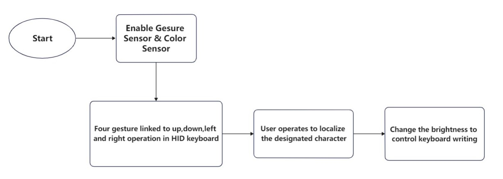

University of Pennsylvania, ESE 5190: Intro to Embedded Systems, Lab 1

    (TODO) XUANANG CHEN
        (TODO) LinkedIn, personal website, twitter, etc.
    Tested on: (TODO) MacBook Pro (14-inch, 2021), macOS Monterey 12.5.1

(TODO: Your README)

Include lab questions, screenshots, analysis, etc. (Remember, this is public, so don't put anything here you don't want to share with the world.)

    
    #custom real-time visualizer
    import board
    from adafruit_apds9960.apds9960 import APDS9960
    import time
    import analogio
    import digitalio
    import usb_hid
    from adafruit_hid.keyboard import Keyboard
    from adafruit_hid.keyboard_layout_us import KeyboardLayoutUS
    from adafruit_hid.keycode import Keycode
    import neopixel
    import busio
    import adafruit_apds9960.apds9960
    i2c = board.STEMMA_I2C()
    sensor = APDS9960(i2c)
    sensor.enable_proximity = True
    sensor.enable_gesture = True
    sensor.enable_color = True
    sensor.color_integration_time = 10
    pixels = neopixel.NeoPixel(board.NEOPIXEL, 1)
    time.sleep(1)  # Sleep for a bit to avoid a race condition on some systems
    keyboard = Keyboard(usb_hid.devices)
    keyboard_layout = KeyboardLayoutUS(keyboard)  # We're in the US :)
    led = digitalio.DigitalInOut(board.SCK)
    led.direction = digitalio.Direction.OUTPUT
    c_min = 0.00
    c_max = 10241.00
    step = (c_max - c_min) / 1000.0
    
    def steps(axis):
        """ Maps the c-range to 0-1000 """
        return round((axis - c_min) / step)

    i=0
    print("Game Start!")

    while True:

        gesture = sensor.gesture()
        r, g, b, c = sensor.color_data

        j=0
        if steps(c)==1000:
            keyboard.press(Keycode.O)
            keyboard.release_all()
            time.sleep(2)
        if steps(c)==0:
            for j in range(0,10):
                if steps(c)==0:
                    time.sleep(0.5)
                else:
                    j=20
                r, g, b, c = sensor.color_data
            if j!=9:
                keyboard.press(Keycode.BACKSPACE)
                keyboard.release_all()
                time.sleep(2)

        if j==9:
            print("Game End")
            break

        if gesture == 0x01:
            print("up")
            keyboard.press(82)
            keyboard.release_all()
        elif gesture == 0x02:
            print("down")
            keyboard.press(81)
            keyboard.release_all()
        elif gesture == 0x03:
            print("left")
            keyboard.press(80)
            keyboard.release_all()
        elif gesture == 0x04:
            print("right")
            keyboard.press(79)
            keyboard.release_all()

        i+=1
