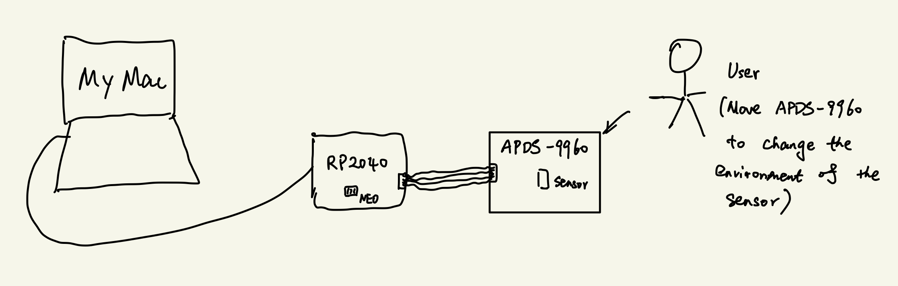

University of Pennsylvania, ESE 5190: Intro to Embedded Systems, Lab 1

    HAO PAN
        https://www.instagram.com/ryanhpan/
    Tested on: MacBook Air (M1, 2020), macOS Monterey 12.5.1

This is the first lab in ESE 5190, it includes:
- Get familiar with and setup for Microcontroller(Adafruit QT Py RP2040) & Proximity/Color/Gesture Sensor Board (APDS9960)
- Track Brightness from sensor and display on neopixel
- Custom Visualization Design

## Part 3.2 Firefly Testing
This part is briefly a test for my setup-sensor.
It basically uses a [video](https://www.youtube.com/watch?t=413&v=BtCGtaMrBXQ&feature=youtu.be) of a firefly to test the sensitivity of my sensor, and keep the neopixel in the RP2040 shine with different brightness with the firefly in the video.
Here is a short video to show:

## Part 4.4 Custom Visualizer
This part deals with a designed visualizer to recognize gestures, write proper information out and shine with different colors by the neopixel.
The visualizer first recognizes a certain gesture(from up, down, left, right), and then provides a sentence on the text editor according to the gesture. Different colors will also be shown on the neopixel with the gesture as a reminder.
Then there's a 0.3 second sleeping time, in order to prevent an error or overlap of identifying gestures within a short time.
Here is also a short video:

## System Diagram

