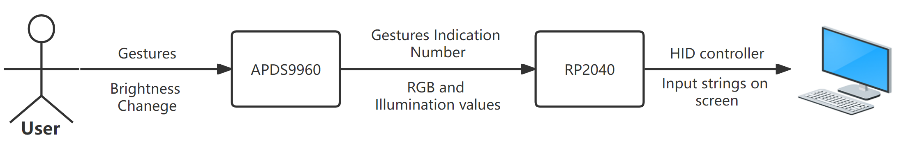
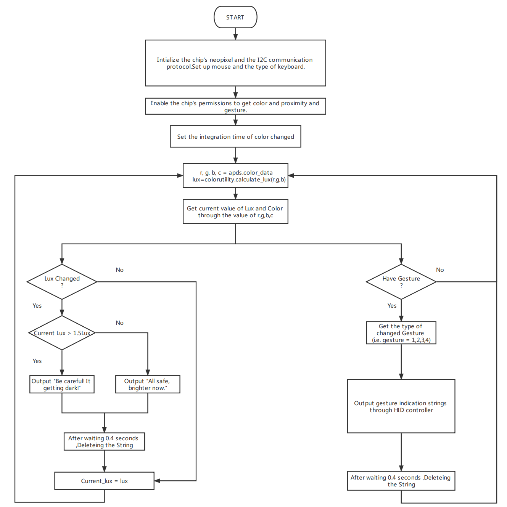

University of Pennsylvania, ESE 5190: Intro to Embedded Systems, Lab 1

    Haoze Wu
        https://www.instagram.com/tomgoh47/
    Tested on: 
        Lenovo Thinkbook16 (16-inch, 2022), Windows 11 21H2 22000.978
        MacBook Pro (16-inch, 2021), macOS Monterey 12.5

This lab session includes:

- Basic setup for Adafruit QT Py RP2040 and APDS9960 sensor board.
- Color recognition and simultaneously display on RP2040's LED pixel.
- Brightness perception and gesture perception and display on PC or Mac.

## Basic Setup

After connecting RP2040 to PC or Mac, entering Bootloader and flashing the firmware.

Then connecting the APDS9960 to RP2040 through STEMMA Qt to Qt cable on the hardware level. On the code level, importing several packages, instantiating the I2C object, and connecting the APDS9960 object to the RP2040's board STEMMA I2C port as follows:

```python
import board
from adafruit_apds9960.apds9960 import APDS9960

i2c = board.STEMMA_I2C()
apds = APDS9960(i2c)
```

To implement more functions, including change the color of RP2040's pixel, read the surrounding objects' colors, and detecting objects' gestures, more packages need to be imported, which we will cover in the following sections.

## Color Recognition and Display
APDS9960 has three main functions: gesture detection, proximity detection, and color and ALS detection. Here, we use the color detection function of RP2040, and display the perceived color on RP2040's pixels.


To detect color nearby, we first should enable the color detection function on APDS9960 by changing APDS9960 `enable_color` property to `True`:
```python
from adafruit_apds9960.apds9960 import APDS9960
apds = APDS9960(i2c)
apds = APDS9960(i2c)
```
After enabling the color recognition function, we could use the property `color_data` to collect real-time color information in front of the sensor:
```python
r, g, b, c = apds.color_data
```
`r`, `g`, `b`, and `c` represents red, green, blue, and clear light intensity values generated by the sensor.
Once we collect the color data using APDS9960, we want to display data using RP2040's pixel to get a real-time indicator of the color. First, we need to initiate the pixel of RP2040 and transfer color data to the pixel so that it could display the color:

```python
import neopixel
import board

pixels = neopixel.NeoPixel(board.NEOPIXEL, 1)

r, g, b, c = apds.color_data
pixels.fill((r, g, b))
```
Since the default sampling rate of the color sensor is not set to the maximum speed, we check the [APDS9960 driver source code](https://github.com/adafruit/Adafruit_CircuitPython_APDS9960/blob/main/adafruit_apds9960/apds9960.py) and find a setter function:
```python
@color_integration_time.setter
def color_integration_time(self, value: int) -> None:
    self._write8(_APDS9960_ATIME, 256 - value)
```
which gives us the ability to increase the sampling rate to achieve a "real" real-time perception of the color by simply calling the setter:
```python
apds.color_integration_time = 0x1
```

We also noticed that there might be a potential bug in the `colorutility` module. If all RGB values perceive are 0, the function [`calculate_color_temperature`](https://github.com/adafruit/Adafruit_CircuitPython_APDS9960/blob/main/adafruit_apds9960/colorutility.py) in module `colorutility` would generate a divided by zero error when calculating `xchrome` and `ychrome` variables.

To show the real-time color perception ability of these simple chips, we followed the instructions in the lab material, using APDS9960 sensor to perceive the color change of a given [firefly video](https://youtu.be/BtCGtaMrBXQ?t=413) and display the color on RP2040's pixel. Full code `3-2-code.py` is available in this repository.

The display result is shown in the gif:


## Brightness and Gesture Perception and HID Display

In this section, we introduce control PC or Mac keyboards to output strings based on Brightness and Gesture Perception.

We design to visualize the brightness changes and object motions through keyboard outputting strings indicating whether it's turning dark or bright and the specific object movement directions on the PC's or Mac's screen.

The display result is shown in the gif:


The diagram of its usage is shown below:



The flow chart of this program is shown below:



In the program, we keep a record of the luminance of the last iteration and make a comparison between the current luminance and the previous luminance to indicate whether the environment is getting darker or brighter. Meanwhile, we enable the proximity sensor and the gesture sensor to monitor the surrounding object's movement. We combine the result of brightness change and the object movement together by pre-defined strings and output them using RP2040's HID controllers. Also, in order to maintain a precise indication, we remove all output strings on the screen after a specific time period, also using RP2040's HID controllers.

