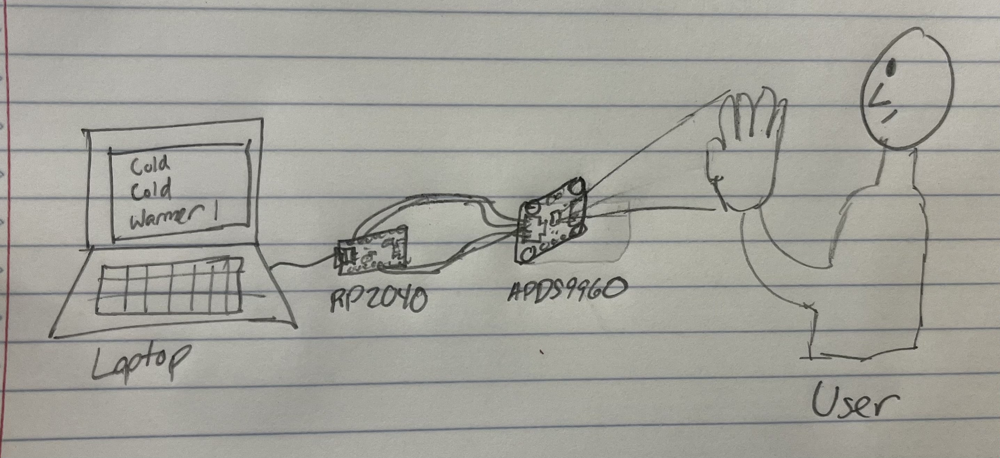

University of Pennsylvania, ESE 5190: Intro to Embedded Systems, Lab 1

    James Ciardullo
    Tested on: MacBook Pro (16-inch, 2019), macOS Monterey 12.6

##4.4. Visualizer

###Overview

My visualizer works by submitting a variety of keyboard input commands depending on the proximity sensor value. If the proximity sensor returns a low value (0-5), it tells the keyboard to type "COLD". If the proximity sensor returns a medium value (5-40), it tells the keyboard to type "WARMER". For all other values (40+), it tells the keyboard to type "HOT". This visualizer provides a cool indicator of how close an object is to the board.

###Diagram

(Excuse the crudeness of the drawing)