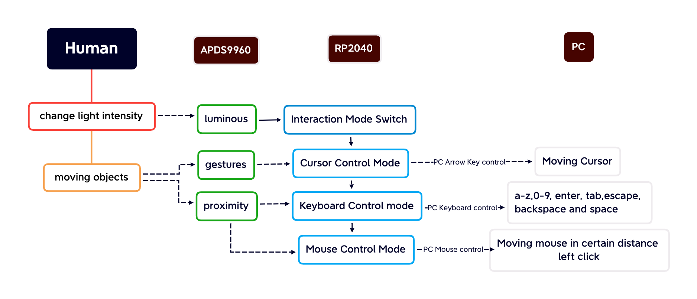

University of Pennsylvania, ESE 5190: Intro to Embedded Systems, Lab 1

    Xingqi Pan
        LinkedIn: https://www.linkedin.com/in/xingqipan
    Tested on: MacBook Pro (14-inch, 2021), macOS Monterey 12.5.1

### Content:
- **Section 3.2 Firefly**
    - **Description:** Firefly-like light flashing with RP2040 and APDS9960
    - **Details:** 
      - In this section, we aim to use APDS9960 and RP2040 to simulate firefly flashing with LED.
      - **Components**:
        - APDS9960: Collect firefly flashing data every cycle
        - RP2040: Using firefly flashing data to change the intensity of LED on the board with a Python program
      - **Functionalities:** The LED on RP2040 will flash synchronize with firefly 
    - **Visualization:**
          
     
- **Section 4.4 Smart Keyboard with RP2040 and APDS9960**
    - **Description:** Using RP2040 to control PC keyboard input and cursor movement with proximity, luminous and gesture data sensed by APDS9960
    - **Details:**
         This embedded system mainly aims to contrust a smart kerboard with only human interaction. This kind of design can help people, espectially disabled people, to record their thoughts and ideas easily on computer.  
      - **Components:** 
        - APDS9960: Sensing human interaction data (luminous, gesture, proximity, etc.) 
        - RP2040: Compiling and running a Python program to transfer interaction data to computer control instruction. 
        - PC: receive the instrucions and take actions. 
           The architecture of this embedded system is shown below in the diagram. 
         
          
      - **Functionalities:**
        - **Interaction mode switcher via luminous** 
          - Collect luminous data on the clear channel as luminous 
          - 0 < clear < 30000: Keyboard control mode 
          - 30000 < clear < 45000: Mouse control mode 
          - 45000 < clear < 65535: cursor control mode 
          - clear == 65535: Shut down the program 
        - **Cursor control mode via gesture** 
          - If entering cursor control mode, the sensor will stay collecting gesture until it receive a non-zero data. 
          - 1: up gesture detected, moving up cursor 
          - 2: down gesture detected, moving down cursor 
          - 3: left gesture detected, moving cursor to the left 
          - 4: right gesture detected, moving cursor to the right  
        - **Keyboard control mode via proximity** 
          - Divided the proximity with range(0,65535) into 40 steps in range(0-39), each steps represents a keycode for typing letters. 
          - Include a-z, 1-9, 0, Enter, Escape, Backspace, Tab, Space 
        - **Mouse control mode via proximity** 
          - Using the differece between current proximity data and previous proximity data to move the mouse, then left click mouse. 
    - **Visualization:**
        
    - **Code**: See code.py for more details

