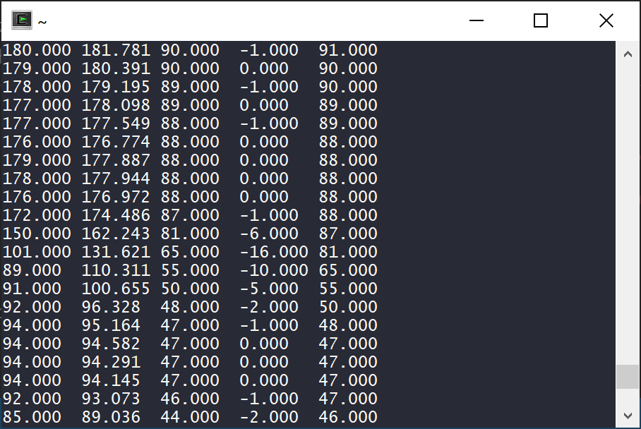
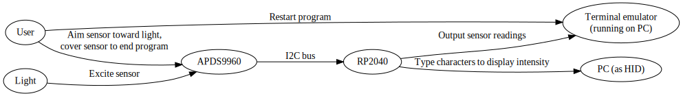

University of Pennsylvania, ESE 5190: Intro to Embedded Systems, Lab 1

    Nikola Obradovic
    Tested on: Adafruit Qt-Pi and Microsoft Surface Book 2
    Terminal: Screen for Cygwin

# Lab 1

## Firefly Visualizer - 3.2

## Custom Visualizer - 4.4
This custom visualizer displays the measured light intensity as an animated bar, represented by a chain of "\\" (backslash) characters typed into a text document. The movement of the bar is smooth thanks to simple filtering.
#### Features
1. Light intensity-triggered start and stop conditions (shine a bright light to begin the program, cover the sensor to end)
2. Basic signal filtering (exponential weighted moving average) to reduce noise in output
3. Console output that displays the light intensity reading from the sensor as well as calculated values

Console output fields as follows:

raw value | filtered value | new percentage reading | delta | old percentage reading

### Diagram of system

### GIF

