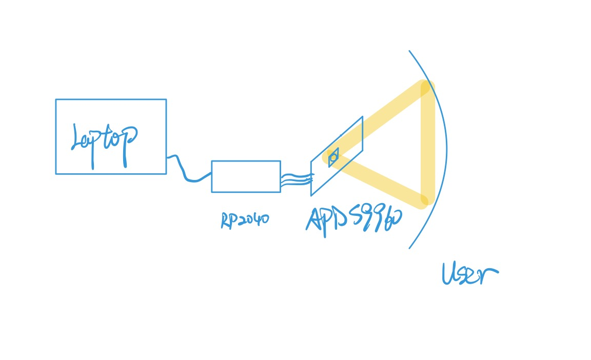

# Lab 1

University of Pennsylvania, ESE 5190: Intro to Embedded Systems, Lab 1

    Xuanbiao Zhu
    Tested on: MacBook Air (M1, 2020), macOS Monterey 12.5

## 3.3. Firefly 

Use *APDS9960* to detect the light from Firefly on [Youtube](https://www.youtube.com/watch?t=413&v=BtCGtaMrBXQ&feature=youtu.be) and represent its light via RGB LED in the *RP2040 board*.

## 4.4. Custom Visualizer

Use *APDS9960* to detect the distance and represent it via RGB LED in the *RP2040 board* and my computer screen.

**Rule:**

1. If you get closer to the sensor, then it prints "Get close" and emits Yellow light.
2. If you get far away from the sensor, then it prints "Get further" and emits Green light.
3. If the distance is so close(greater than 200), then it prints "Need to stop" and emits Red light. 

**Diagram**

