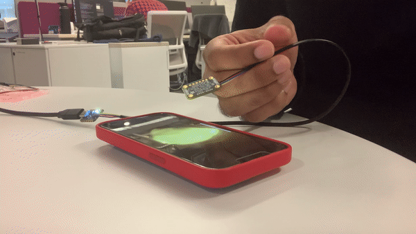

University of Pennsylvania, ESE 5190: Intro to Embedded Systems, Lab 1
```
Chenwei Tang
  email:tchenwei@seas.upenn.edu
  Linkedin:https://www.linkedin.com/in/chenwei-tang-3328a224b/
 Tested on: Legion Y7000, Windows 10 21H2
```
# Introduction
This is the first lab of ESE 5190, the main purpose of this lab is to learn how to use and debug a MCU(RP2040) and a sensor(APDS9960). And we will finish a embedded system which can use an interesting way to display the sensor data.
# 3.2 Firefly
In this part, we will use APDS9960 to track the brightness of the video(https://youtu.be/BtCGtaMrBXQ?t=413). We should make our little LED shine in tune with the firefly in the video. Here is a gif showing the function.


In this part, what we need to do first is to set the color_integration_time in order to make this system real-time, and I set this value 150, this is enough. If the integration time is too fast, the brightness cannot be read correctly.
# 4.4 Custom Real-time Visualizer
In this part, I design a system in which a "o" can move by following my gesture. At first, RP2040 will read the value of brightness, if the brightness is too high, the "o" will change into "X", and stop moving. If the brightness is in the proper range, the "o" will follow my gesture. For example, I move my hand rightward, the "o" will move in the same way. And it's shown in the following picture.


Moreover, if the brightness is smaller than one specific value, the loop will break and then the program will finish.
