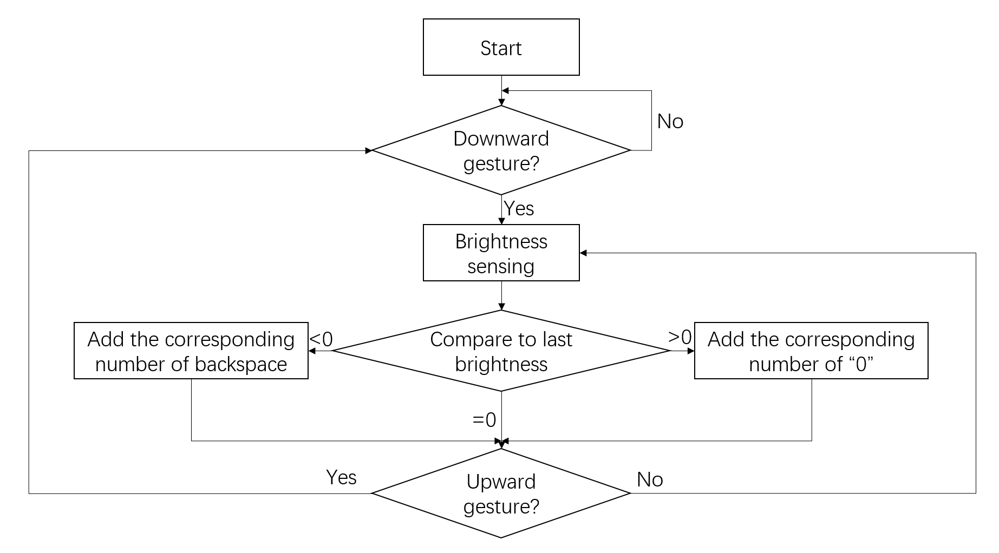
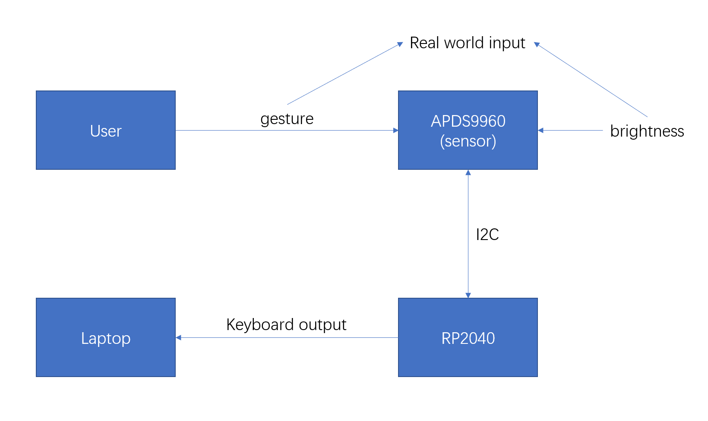

University of Pennsylvania, ESE 5190: Intro to Embedded Systems, Lab 1

    Qiwen Luo
        https://www.linkedin.com/in/qiwen-luo-33a058226/
    Tested on: ROG Zephyrus M16, Windows 10 21H2

# Introduction 

This is for the first lab of ESE 5190, which includes simple uses of curcuitPython on Adafruit QT Py RP2040 and the sensor board Adafruit APDS9960.

# 3.2 Firefly

In this part, we are supposed to build a synchronization system of firefly glow (https://youtu.be/BtCGtaMrBXQ?t=413). And this can simply realized by the brightness sensor on APDS9960, which is include in the function of color detection.

In order to make the system real-time, the response time of color detection should be adjusted and the details can be find in the APDS9960 Library([APDS9960 — Adafruit APDS9960 Library 1.0 documentation (circuitpython.org)](https://docs.circuitpython.org/projects/apds9960/en/latest/api.html#adafruit_apds9960.apds9960.APDS9960.color_integration_time))

| `color_integration_time` | Time    | Max Count | Note             |
| ------------------------ | ------- | --------- | ---------------- |
| 1                        | 2.78 ms | 1025      | Power-on Default |
| 10                       | 27.8 ms | 10241     |                  |
| 37                       | 103 ms  | 37889     |                  |
| 72                       | 200 ms  | 65535     |                  |
| 256                      | 712 ms  | 65535     | Driver Default   |

Too short reaction time is not sensitive enough for the brightness. Thus, after experiments, the value `color_integration_time`   is chosen to be 37.

And the main part of the code is as follow

```python
while True:
    r, g, b, c = sensor.color_data
    print("r: {}, g: {}, b: {}, c: {}".format(r, g, b, c))
    if c >= 80:
        led.fill((255, 255, 0)) # turn on the led on the board
    else:
        led.fill((0, 0, 0))
```

A work demo is as shown in the gif


#4.4 Custom real-time visualizer

In this part, a real-time visual light sensing system is build.

It has a switch, and a text bar graph (filled with "0") will be shown on your computer which represents the current brightness.


When the board is powered, the system goes into standby until the switch is turned on (a downward gesture is detected) and the light detection starts working. When an upward gesture is detected, the light check stops and the system goes back into standby.

For gesture detection, we just call the detection function repeatedly, until it detects the downward gesture, then go in to the light sensing loop. Also, we use break to jump out of the loop.

```python
def findgesture():
    gesture = sensor.gesture()
    return gesture

while True:
    if findgesture() == 0x01: #which should be rotated by 180 degree
    ...
```

And the logic flowchart of this system:




Finally, the relationship between different devices or user can be seen from this picture:

